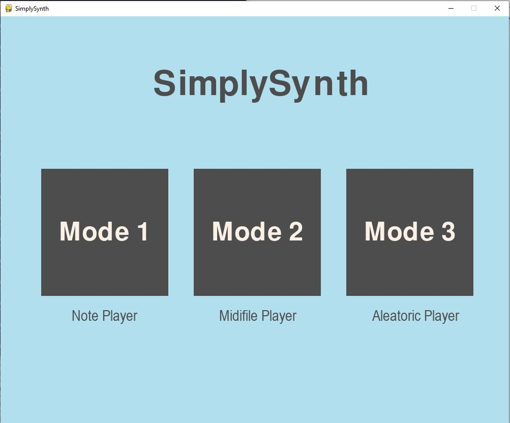
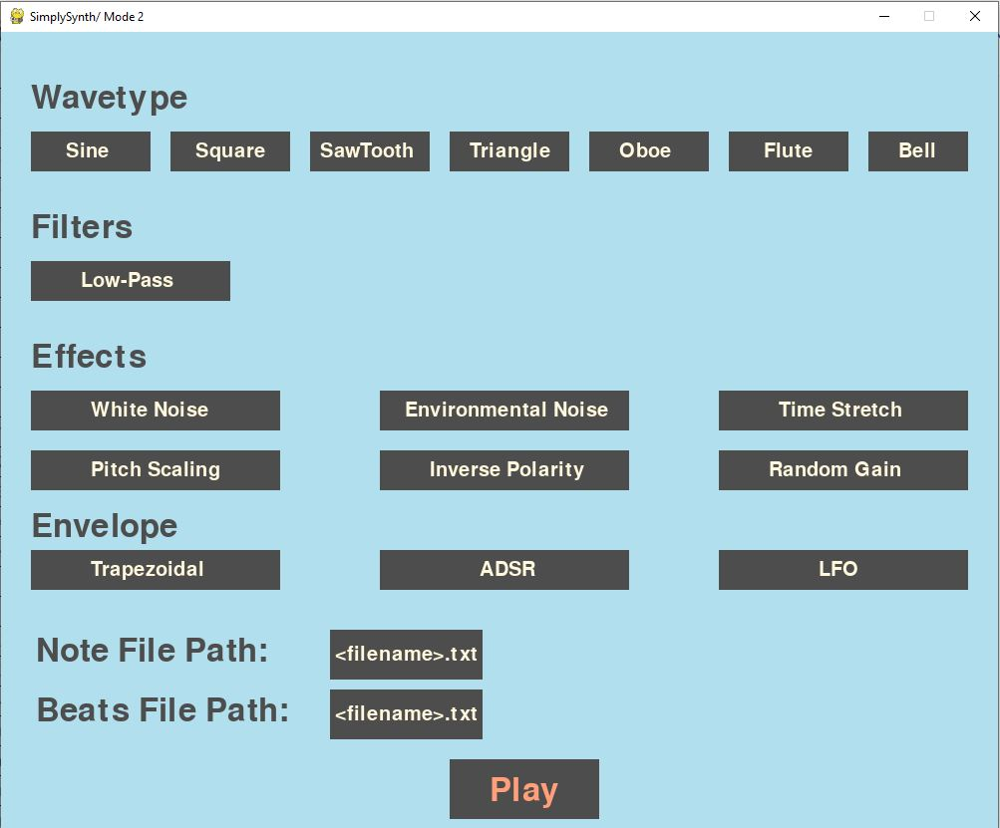

# SimplySynth

Implementation of a simplistic synthesizer in Python
<br /><br />


## How it went
Our vision was to build a synthesizer that bears some fundamental characteristics and is also fun to play with. We divided the tasks between the two of us and parallely began working on different pieces in a bottom-up fashion.<br /><br />
First, we created sine, square, sawtooth and triangle oscillators and tested those using notes fed from a text file. Having tested the waveforms, we were excited to use MIDI file inputs. One of the most intricate parts was reading the MIDI file and transforming it into a datastructure such that multiple notes may begin at the same time or overlapping intervals. Using additive synthesis, we combined multiple waves to deliver one coherent wave.<br /><br />
Furthermore, we worked on adding effects, filters and envelopes to make the synthesized sound more real. Side by side, we studied about timbre of musical instruments and sound and attempted to synthesize those. We used audacity to compare our shots with sounds of real instruments and improved our attempts incrementally. We were ecstatic after creating the sound of an [oboe](https://gitlab.cecs.pdx.edu/sound-engineering/simplysynth/-/blob/main/Files/wav%20files/savedrecording/silen_night_oboe.wav) and then implemented a [bell](https://gitlab.cecs.pdx.edu/sound-engineering/simplysynth/-/blob/main/Files/wav%20files/savedrecording/bell-1.wav), [flute](https://gitlab.cecs.pdx.edu/sound-engineering/simplysynth/-/blob/main/Files/wav%20files/savedrecording/notes-on-a-flute.wav) and [violin](https://gitlab.cecs.pdx.edu/sound-engineering/simplysynth/-/blob/main/Files/wav%20files/savedrecording/harry_potter-violin.wav).


## Division of responsibilities
All the tasks were accomplished through gitlab merge requests and thus can be verified here: [merged requests](https://gitlab.cecs.pdx.edu/sound-engineering/simplysynth/-/merge_requests?scope=all&state=merged)
| | Tasks  |
|---|---|
| Harman | MIDI file input, envelopes, filters, Pygame GUI, flute  |
|  Kaushambi |  Oscillators, additive synthesis, effects, user interface handler, oboe, bell |

## Lessons learned
<ol>
<li>Frequency modulation was more difficult than we expected. We had not accounted for it in the beginning stages where we structured the code.</li>
<li>Real, natural sounds are beautifully imperfect- simulating the 'imperfectness' is challenging.</li>
<li>Using Gitlab helped us manage the project.</li>
</ol>


## Compositions 
Check out a few pre-recorded examples [here](https://gitlab.cecs.pdx.edu/sound-engineering/simplysynth/-/tree/main/Files/wav%20files/savedrecording).

 ## Running the code
 Please install these libraries using the following bash command:
 ```bash
 pip install mido
 pip install numpy
 pip install soundaudio
 pip install scipy
 pip install pygame
 pip install pygame-gui
 pip install librosa
 ````

Load the GUI- Note: after typing the file name in the input box, press enter.
```bash
python synth.py
```
Alternatively, you could also run examples:
```bash
python examples.py
```
## Features
### Modes
<ol>
<li>Mode A: Input notes and corresponding duration in form of text files</li>
<li>Mode B: MIDI input file</li>
<li>Mode C: Aleatoric</li>
</ol>

### Options
#### Wave Type
Sine, Square, Sawtooth, Triangle
Oboe, Flute, Bell

#### Envelopes
Trapezoidal, ADSR

#### Effects
<ol>
  <li>White noise: random signal</li>
  <li>Environmental noise: a soothing background sound of forest at night</li>
  <li>Time Stretch: increases the duration of each note</li>
  <li>Pitch Scaling: changes the pitch of the audio</li>
  <li>Inverse Polarity: reverses the amplitude of the signal</li>
  <li>Random Gain: increases the amplitude by some random value</li>
</ol>

### Filters
Low-pass band, High-pass band

## Known Issues
- Unable to play midi files that don’t consistently contain a “note-off” message for every “note-on”
- The GUI is not responsive which is why we suggest to use examples.py instead
- ‘Click’ sound can be heard while playing some midi files
- Selecting multiple options on a huge midi file is computationally expensive and takes more time
- Aleatoric mode only plays for major notes

## Extensions
<ol>
<li>Simulate the sound of complex instruments such as the piano, guitar, etc</li>
<li>Simulate percussion instruments</li>
</ol>

## Authors
- Harmandeep Singh
- Kaushambi Gujral
